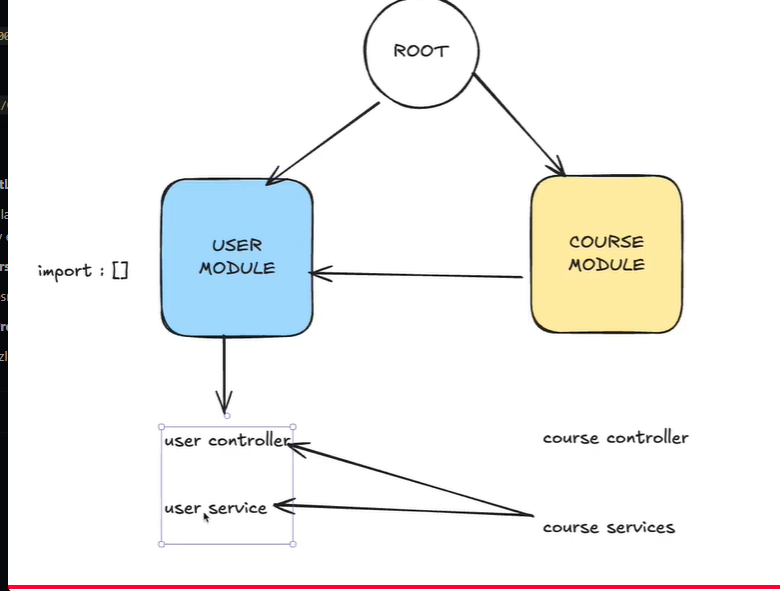

# 📘 10 - NestJS-də Dependency Injection (DI) və Inversion of Control (IoC)

Bu sənəddə NestJS-in ən vacib 2 təməl prinsipi olan **Inversion of Control (IoC)** və **Dependency Injection (DI)** anlayışları, onların fərqi, NestJS daxili IoC Konteynerinin işləmə mexanizmi və Modullararası Asılılıqların Paylaşılması (Module Scope) ətraflı izah olunur.

---

## 🖼️ Şəkil 1 və 2: Inversion of Control (IoC) Nədir?
### 💡 Anlayış:
**Inversion of Control (IoC) — İdarəetmənin Tərsinə Çevrilməsi** dizayn prinsipidir.
Ənənəvi proqramlaşdırmada obyektin nə vaxt və necə yaradılacağını proqramçının öz kodu idarə edir. IoC prinsipində isə obyektlərin yaradılması və idarə olunması proqramçıdan alınıb **freymvorkun (NestJS Container)** öhdəliyinə verilir.

### ❌ IoC Olmadan (Ənənəvi Yanaşma - Traditional Approach):
Class öz asılılıqlarını (servislərini) özü `new` açar sözü ilə yaradır.
```typescript
// Obyektlərin yaradılmasını PROQRAMÇI idarə edir
class OrdersService {
  private usersService: UsersService;
  private emailService: EmailService;

  constructor() {
    // ❌ Class öz servis obyektlərini özü daxildə new edir!
    this.usersService = new UsersService();
    this.emailService = new EmailService();
  }
}
```
* **Problemi**: `UsersService` dəyişəndə `OrdersService` də xarab olur (Spagetti / Sıkı bağlı kod - Tight Coupling).

### ✅ IoC İlə (NestJS Yanaşması - NestJS Approach):
Obyektlərin yaradılmasını freymvork idarə edir.
```typescript
// Obyektlərin yaradılmasını FREYMVORK (NestJS) idarə edir
@Injectable()
class OrdersService {
  // ✅ Asılılıqlar freymvork tərəfindən konstruktora daxil edilir (pass olunur)
  constructor(
    private usersService: UsersService,
    private emailService: EmailService,
  ) {}
}
```

---

## 🖼️ Şəkil 3: Dependency Injection (DI) Nədir və IoC ilə Fərqi?
### 🧠 IoC vs DI (Prinsip vs Texnika):

```text
+-----------------------------------------------------------------+
|  IoC = The Principle (WHAT)                                     |
|  "Don't call us, we'll call you" (Prinsip: Nə edilməlidir?)     |
|                                                                 |
|  DI  = The Technique (HOW)                                      |
|  "Pass dependencies through constructor" (Texnika: Necə edilir?)|
+-----------------------------------------------------------------+
```

- **IoC (Inversion of Control)**: Fəlsəfə və Prinsipdir ("Bizə zəng etməyin, biz sizə zəng edəcəyik").
- **DI (Dependency Injection)**: IoC prinsipini koda tətbiq etmə **Texnikasıdır** (Asılılıqların obyektə konstruktor vasitəsilə dənizdən ötürülməsi).

---

## 💉 Dependency Injection (DI) Ətraflı İzahı (Xüsusi Bölmə)

**Dependency Injection (Asılılığın İnyeksiyası)** — Bir class-ın ehtiyac duyduğu digər obyektləri (asılılıqları) öz daxilində yaratmaq (`new`) əvəzinə, həmin obyektlərin ona **çöldən (konstruktor vasitəsilə) daxil edilməsi (inject olunması)** texnikasıdır.

### ❓ Asılılıq (Dependency) Nədir?
Əgər `UserController` işləmək üçün `UserService`-ə ehtiyac duyursa, `UserService` klassı `UserController` üçün bir **Asılılıqdır (Dependency)**.

---

### 💉 NestJS-də DI Necə İşləyir? (3 Əsas Addım)

NestJS-də Dependency Injection 3 əsas addımla baş verir:

#### 1-ci Addım: Servisi Enjekte Edilə BİLƏN Etmək (`@Injectable()`)
Servis klassının üzərinə `@Injectable()` dekoratoru qoyulur. Bu, NestJS-ə bildirir ki: *"Bu class IoC Container tərəfindən idarə oluna və başqa yerlərə inject edilə bilər."*

```typescript
import { Injectable } from '@nestjs/common';

@Injectable() // 🟢 1. NestJS-ə deyirik ki, bu servis inject oluna bilər
export class UserService {
  getUsers() {
    return ['Ali', 'Leyla'];
  }
}
```

#### 2-ci Addım: Servisi Modulda Qeydiyyata Almaq (`providers`)
Servis modulun `providers` siyahısına əlavə olunur. Bu addımda NestJS həmin servisi öz **Provider Registry** cədvəlinə daxil edir:

```typescript
import { Module } from '@nestjs/common';
import { UserController } from './user.controller';
import { UserService } from './user.service';

@Module({
  controllers: [UserController],
  providers: [UserService], // 🟢 2. IoC Container-də qeydiyyata alırıq
})
export class UserModule {}
```

#### 3-cü Addım: Servisi Konstruktorda İnyeksiya Etmək (`constructor`)
Kontroler və ya başqa bir servis bu servisi istifadə etmək üçün öz konstruktorunda elan edir. NestJS avtomatik olaraq `UserService`-in yaranmış obyektini konstruktora verir:

```typescript
import { Controller, Get } from '@nestjs/common';
import { UserService } from './user.service';

@Controller('users')
export class UserController {
  // 🟢 3. NestJS hazır UserService obyektini bura INJECT edir!
  constructor(private readonly userService: UserService) {}

  @Get()
  getAll() {
    return this.userService.getUsers(); // ✅ `this.userService` istifadəyə hazırdır
  }
}
```

---

## ⚙️ NestJS IoC Container-in 4 Əsas Vəzifəsi:

NestJS daxilində quraşdırılmış mərkəzi **IoC Container** var. Bu konteyner:
1. **Registers**: Bütün provider-ləri (servisləri, repozitoriyaları) qeydiyyata alır.
2. **Resolves**: Asılılıqları avtomatik təhlil edir və tapır.
3. **Creates and manages**: Obyektlərin yaranmasını və ömrünü (Lifecycle / Singleton) idarə edir.
4. **Injects**: Lazım olan yerə (Konstruktora) servisi avtomatik ötürür.

---

## 🖼️ Şəkil 4: NestJS IoC Container-in Daxili İşləmə Mexanizmi


```text
+---------------------------------------------------------------------------------+
|                              NestJS IoC Container                               |
|                                                                                 |
|  +---------------------------------------------------------------------------+  |
|  |                             Provider Registry                             |  |
|  |                                                                           |  |
|  |  Token: UsersService      ---> Class: UsersService                        |  |
|  |  Token: OrdersService     ---> Class: OrdersService                       |  |
|  |  Token: EmailService      ---> Class: EmailService                        |  |
|  |  Token: 'DATABASE'        ---> Value: DatabaseConnection                  |  |
|  +---------------------------------------------------------------------------+  |
|                                       |                                         |
|                                       | resolves (həll edir)                    |
|                                       v                                         |
|  +---------------------------------------------------------------------------+  |
|  |                              Instance Cache                               |  |
|  |                                                                           |  |
|  |  UsersService             ---> [Singleton Instance]                       |  |
|  |  OrdersService            ---> [Singleton Instance]                       |  |
|  |  EmailService             ---> [Singleton Instance]                       |  |
|  +---------------------------------------------------------------------------+  |
+---------------------------------------------------------------------------------+
```

### 🔍 Mexanizmin addım-addım izahı:
1. **Provider Registry**: Modul yüklənəndə NestJS hər bir servisi xüsusi Token (Açar) ilə qeydiyyata alır (`Token: UsersService -> Class: UsersService`).
2. **Resolves**: Servislərin konstruktorlarını oxuyaraq hansı servisin kimdən asılı olduğunu müəyyən edir.
3. **Instance Cache (Singleton)**: Hər bir servisdən operativ yaddaşda (RAM) yalnız **1 ədəd obyekt (Singleton Instance)** yaradır və yaddaşda saxlayır. Hər dəfə yeni `new` etmir, eyni obyekti hamıya paylayır.

---

## 🖼️ Şəkil 5: Modullararası Asılılıqların Paylaşılması (Module Dependency Graph)



### 💡 Modul İerarxiyası:
* **ROOT (AppModule)**: Ana modul. `UserModule` və `CourseModule`-u özündə birləşdirir.
* **UserModule**: `UserService` və `UserController`-ə sahibdir.
* **CourseModule**: `CourseService` və `CourseController`-ə sahibdir.

### 🔄 `CourseModule`-un `UserService`-dən istifadə etməsi üçün şərtlər:
1. `UserModule` öz daxilində `UserService`-i **`exports`** etməlidir:
   ```typescript
   @Module({
     controllers: [UserController],
     providers: [UserService],
     exports: [UserService], // 🟢 Dışarıya eksport olunur
   })
   export class UserModule {}
   ```
2. `CourseModule` isə `UserModule`-u **`imports`** etməlidir:
   ```typescript
   @Module({
     imports: [UserModule], // 🟢 UserModule daxil edilir
     controllers: [CourseController],
     providers: [CourseService],
   })
   export class CourseModule {}
   ```
3. Nəticədə `CourseController` və `CourseService` daxilində `UserService`-i rahatlıqla konstruktora inject edib işlədə bilərsiniz:
   ```typescript
   constructor(private readonly userService: UserService) {}
   ```

---

## 🎯 Ən Sadə Xülasə: IoC və DI Əslində Nədir?

Bütün bu deyilənləri **1 real həyat analogiyası** və **3 qızıl qayda** ilə yadda saxlaya bilərsiniz:

### 🏨 Real Həyat Analogiyası (Restoran Nümunəsi):

* **❌ IoC-dən Əvvəl (Ənənəvi Kod)**: Siz restorana gedirsiniz. Yemək yemək üçün özünüz mətbəxə keçirsiniz, tavanı, yağı, əti özünüz alıb yeməyi özünüz bişirirsiniz (`new OrdersService()`). Bütün alətləri siz idarə edirsiniz.
* **✅ IoC İlə (NestJS Yolu)**: Siz masada oturursunuz və ofisianta sadəcə deyirsiniz: *"Mənə bir steak gətir"*. Əti hardan almaq, tavanı necə qızdırmaq, yeməyi necə bişirmək **Aşpazın və Restoranın (NestJS Container)** işidir. Sizə sadəcə hazır yemək (Obyekt/Instance) təqdim olunur.

---

### 📌 3 Qızıl Qayda:

1. **IoC (Inversion of Control) — Mantıqdır / Fəlsəfədir**:
   Obyektləri `new Servis()` deyərək proqramçının yaratması əvəzinə, obyekt yaratma səlahiyyətini NestJS freymvorkuna verməkdir.

2. **DI (Dependency Injection) — Texnikadır / Yoldur**:
   Obyektin ehtiyacı olan digər servisləri öz daxilində yaratması əvəzinə, həmin servislərin ona **konstruktor (`constructor`) vasitəsilə kənardan ötürülməsidir**.

3. **Bizə Nə Qazandırır?**:
   - ⚡ **Modulyarlıq**: Kod spagetti olmur, hər servis yalnız öz işini görür.
   - 🧪 **Asan Test Olunma**: Test yazarkən həqiqi baza/servis əvəzinə rahatlıqla saxta (Mock) servis ötürə bilirik.
   - 🔄 **Yenidən İstifadə**: Sabah `UserService`-in kodunu dəyişdikdə, proqramın digər 20 yerindəki kodu təkrar yazmaq məcburiyyətində qalmırıq.
