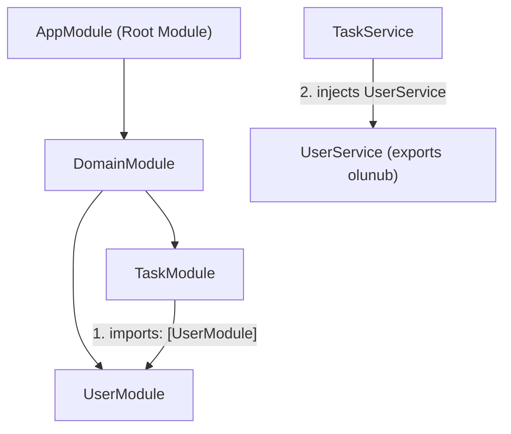

# 🏗️ NestJS-də Multi-Module (Çoxlu Modul) Arxitekturası — Ən Sadə İzahlı Təlimat

Salam! NestJS öyrənməyə başlayan dostum, xoş gəldin! 

Bu sənəddə **NestJS-də Çoxlu Modul (Multi-Module) arxitekturasının** nə olduğunu, modulların bir-biri ilə necə **`import`** və **`export`** olunduğunu **ən sadə dildə, 1 canlı nümunə üzərindən** addım-addım öyrənəcəksən.

---

## ❓ 1. Multi-Module (Çoxlu Modul) Nədir və Niyə Lazımdır?

### 💡 Sadə Dildə Analogiya:
Təsəvvür et ki, böyük bir **Xəstəxanadasan**:
* **Bütöv bina (`AppModule`):** Xəstəxananın baş binasıdır.
* **Şöbələr (Modullar):** 
  * **Qeydiyyat Şöbəsi (`UserModule`):** Xəstələrin adını, məlumatlarını qeydə alır.
  * **Həkim Şöbəsi (`TaskModule` / Müayinə):** Xəstələrə müayinə və tapşırıqlar təyin edir.

Əgər Həkim Şöbəsi xəstəyə resept yazmaq istəyirsə, əvvəlcə Qeydiyyat Şöbəsindən xəstənin sistemdə var olub-olmadığını öyrənməlidir. Yəni **Həkim Şöbəsi (`TaskModule`)**, **Qeydiyyat Şöbəsini (`UserModule`) özünə `import` etməlidir!**

---

## 📁 2. Qovluq Stukturu (Folder Structure)

Gəl şəkillərdə gördüyümüz layihə strukturunu quraq:

```text
src/
├── user/                       # 1-ci Modul: İstifadəçilər
│   ├── user.controller.ts      # HTTP İstəkləri (GET /users)
│   ├── user.service.ts         # İstifadəçi Məntiqi (findUserById)
│   ├── user.dao.service.ts     # Databaza Əməliyyatları (DAO)
│   ├── user.dto.ts             # Data Transfer Obyekti
│   ├── user.entity.ts          # Databaza Modeli
│   └── user.module.ts          # User Modulunun Qeydiyyatı
│
├── task/                       # 2-ci Modul: Tapşırıqlar
│   ├── task.controller.ts      # HTTP İstəkləri (POST /tasks)
│   ├── task.service.ts         # Tapşırıq Məntiqi (createTask)
│   └── task.module.ts          # Task Modulunun Qeydiyyatı
│
├── domain.module.ts            # Bütün Domain Modullarını Toplayan Modul
└── app.module.ts               # Əsas (Root) Modul
```

---

## 🛠️ 3. Canlı Nümunə: Task Yaradarkən User-in Yoxlanılması

### 🎯 Bizim Məqsədimiz:
Biri yeni bir tapşırıq yaradanda (`POST /tasks`), `TaskService` gedib `UserService`-dən soruşmalıdır: *"Bu ID-li istifadəçi sistemdə var?"*

Bunun üçün **3 Qızıl Addım** atacağıq:

---

### 1️⃣ Addım 1: `UserModule`-da `UserService`-i `export` edirik!

Daxili qaydaya görə, bir modulun servisini çöldəki modullara vermək üçün onu mütləq **`exports`** massivinə yazmalıyıq.

```typescript
// 📄 user/user.module.ts
import { Module } from '@nestjs/common';
import { UserController } from './user.controller';
import { UserService } from './user.service';
import { UserDaoService } from './user.dao.service';

@Module({
  controllers: [UserController],
  providers: [UserService, UserDaoService],
  exports: [UserService], // 👈 ÇOX VACİB: UserService-i çölə açırıq ki, TaskModule istifadə edə bilsin!
})
export class UserModule {}
```

---

### 2️⃣ Addım 2: `TaskModule`-a `UserModule`-u `import` edirik!

İndi `TaskModule`-a deyirik ki: *"Sən UserModule-un imkanlarından istifadə edə bilərsən."*

```typescript
// 📄 task/task.module.ts
import { Module } from '@nestjs/common';
import { TaskController } from './task.controller';
import { TaskService } from './task.service';
import { UserModule } from '../user/user.module'; // 👈 UserModule-u çağırırıq

@Module({
  imports: [UserModule], // 👈 UserModule-u daxil edirik!
  controllers: [TaskController],
  providers: [TaskService],
})
export class TaskModule {}
```

---

### 3️⃣ Addım 3: `TaskService` daxilində `UserService`-i istifadə edirik!

İndi `TaskService`-in konstruktorunda `UserService`-i **Dependency Injection** vasitəsilə inject edib rahatlıqla çağırırıq:

```typescript
// 📄 task/task.service.ts
import { Injectable, NotFoundException } from '@nestjs/common';
import { UserService } from '../user/user.service'; // 👈 UserService-i daxil edirik

@Injectable()
export class TaskService {
  // ✅ TaskService artıq UserService-dən istifadə edə bilir!
  constructor(private readonly userService: UserService) {}

  createTask(title: string, userId: number) {
    // 1. UserModule-dakı UserService vasitəsilə istifadəçini tapırıq
    const user = this.userService.findUserById(userId);

    // 2. Əgər istifadəçi yoxdursa, xəta qaytarırıq
    if (!user) {
      throw new NotFoundException(`ID-si ${userId} olan istifadəçi tapılmadı!`);
    }

    // 3. İstifadəçi varsa, tapşırığı yaradırıq
    return {
      taskId: Date.now(),
      title: title,
      assignedTo: user.name,
      status: 'Yaradıldı',
    };
  }
}
```

---

## 🌐 4. Modulların Birləşdirilməsi (`DomainModule` & `AppModule`)

Sistem böyüdükcə bütün biznes modullarını (`UserModule`, `TaskModule`, `OrderModule` və s.) bir yerə toplayan **`DomainModule`** yaradılır:

```typescript
// 📄 domain.module.ts
import { Module } from '@nestjs/common';
import { UserModule } from './user/user.module';
import { TaskModule } from './task/task.module';

@Module({
  imports: [UserModule, TaskModule], // 👈 Bütün domen modulları buradadır
  exports: [UserModule, TaskModule],
})
export class DomainModule {}
```

Və ən sonda əsas Root Modulumuz **`AppModule`** `DomainModule`-u daxil edir:

```typescript
// 📄 app.module.ts (Root Module)
import { Module } from '@nestjs/common';
import { DomainModule } from './domain.module';

@Module({
  imports: [DomainModule], // 👈 Baş modul bütöv sistemi işə salır
})
export class AppModule {}
```

---

## 🗺️ Modul Asılılıq Ağacı (Dependency Tree Diagram)



---

## 🎯 Yekun Xülasə (Qızıl Qaydalar)

1. **`providers: [...]`** — Modulun öz daxilində istifadə etdiyi servislər.
2. **`exports: [...]`** — Başqa modulların istifadə etməsinə icazə verdiyimiz servislər. (Əgər `exports: [UserService]` yazmasan, `TaskModule` onu görə bilməyəcək və xəta verəcək!).
3. **`imports: [...]`** — Başqa modulların `exports` etdiyi servisləri öz daxilimizə gətirmək üçün istifadə olunur.
