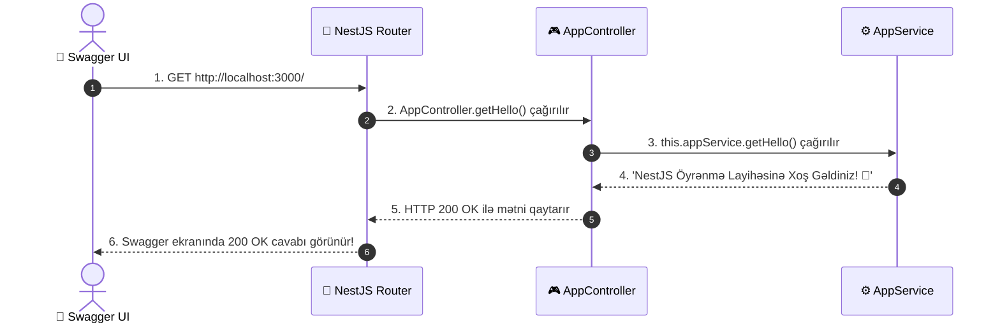

# 🔍 Swagger Live Examples & Exception Handling Explained (Canlı Nümunələrin İzahı)

Bu sənəddə Swagger UI üzərindən test etdiyimiz **2 real nümunənin** — Uğurlu `GET /` istəyi və Xətalı `POST /auth/login` (401 Unauthorized) istəyinin arxa fonda necə işlədiyini addım-addım öyrənəcəksən.

---

## 1️⃣ Nümunə 1: `GET /` (Uğurlu Cavab - 200 OK)

### 📸 Sual: Swagger-də `GET /` düyməsinə basanda mətn necə gəlir?
Swagger-də `GET /` testi etdikdə server `200 OK` statusu ilə bu cavabı qaytarır:
> **Response Body:** `NestJS Öyrənmə Layihəsinə Xoş Gəldiniz! 🚀`

---

### 🔍 Mətn Haradan Gəlir və Necə Çağırılır?

Bütün bu proses **3 faylın zəncirvari birlikdə çalışması** ilə baş verir:

#### Step 1: Mətni Saxlayan Yer — `app.service.ts`
Mətn ilk növbədə `app.service.ts` faylının daxilində yazılıb:
```typescript
@Injectable()
export class AppService {
  getHello(): string {
    return 'NestJS Öyrənmə Layihəsinə Xoş Gəldiniz! 🚀'; // 👈 Mətn buradadır
  }
}
```

#### Step 2: Mətni Çağıran və URL-ə Bağlayan Yer — `app.controller.ts`
Mətni istifadəçiyə çatdırmaq üçün `app.controller.ts` faylı işə düşür:
```typescript
@Controller() // 📍 Mötərizə boşdur, yəni kök URL: http://localhost:3000/
export class AppController {
  // 1. NestJS Dependency Injection vasitəsilə AppService-i daxil edirik
  constructor(private readonly appService: AppService) {}

  @Get() // 📍 HTTP GET http://localhost:3000/ istəyi atanda bu metod çağırılır!
  getHello(): string {
    // 2. Controller AppService-in içindəki getHello() metodunu çağırır!
    return this.appService.getHello();
  }
}
```

#### Step 3: Onları Birləşdirən Yer — `app.module.ts`
NestJS-in bu iki fayldan xəbərdar olması üçün `app.module.ts` faylında `AppController` `controllers` massivinə, `AppService` isə `providers` massivinə yazılıb:
```typescript
@Module({
  controllers: [AppController], // 👈 Controller qeyd olunub
  providers: [AppService],       // 👈 Service qeyd olunub
})
export class AppModule {}
```

---

### 🔄 Tam İcra Axını (Zaman Sırası):



---

## 2️⃣ Nümunə 2: `POST /auth/login` (Xətalı Cavab - 401 Unauthorized)

### 📸 Sual: `POST /auth/login` edəndə niyə 401 Xətası gəldi?
Swagger-də `POST /auth/login` düyməsinə basdıqda server `401 Unauthorized` kodu ilə bu JSON xətasını qaytarır:

```json
{
  "message": "Daxil edilən e-poçt ünvanı tapılmadı!",
  "error": "Unauthorized",
  "statusCode": 401
}
```

---

### 🔍 Nə Baş Verib? (Niyə 401 Xətası Aldıq?)

Şəkildə görünür ki, Swagger-də `POST /auth/login` testi zamanı **Body hissəsində e-poçt göndərilməyib və ya göndərilən e-poçt sistemdə (bazada) mövcud deyil!**

---

### 🔄 Zəncirvari İcra Axını:

#### Step 1: Controller İstəyi Qarşılayır (`auth.controller.ts`)
Swagger-dən `POST http://localhost:3000/auth/login` istəyi gəlir:
```typescript
@Controller('auth')
export class AuthController {
  constructor(private readonly authService: AuthService) {}

  @Post('login')
  login(@Body('email') email: string) {
    return this.authService.login(email); // 👈 Body-dən gələn email-i AuthService-ə ötürür
  }
}
```

#### Step 2: Service Yoxlayır və Xəta Atır (`auth.service.ts`)
`AuthService` daxilindəki `login` metodu istifadəçilər siyahısından daxil edilən e-poçtu axtarır:
```typescript
@Injectable()
export class AuthService {
  constructor(private readonly userService: UserService) {}

  login(email: string) {
    const users = this.userService.getAllUsers();
    const user = users.find((u) => u.email === email);

    // 🚨 Əgər e-poçt tapılmasa, NestJS-in hazır xəta klasını atırıq (throw):
    if (!user) {
      throw new UnauthorizedException('Daxil edilən e-poçt ünvanı tapılmadı!');
    }

    return { accessToken: 'mock-jwt-token', user };
  }
}
```

#### Step 3: NestJS Xətanı Qablaşdırır (Automatic Exception Handling)
Sən koda `throw new UnauthorizedException(...)` yazan kimi NestJS daxili **Exception Filter** mexanizmini işə salır və həmin xətanı avtomatik bu gözəl JSON formatına salaraq Swagger-ə qaytarır:

```json
{
  "message": "Daxil edilən e-poçt ünvanı tapılmadı!",
  "error": "Unauthorized",
  "statusCode": 401
}
```

---

### 💡 Uğurlu Cavab Almaq Üçün Nə Etməliyik?
Swagger-də Body hissəsinə sistemdə mövcud olan e-poçt ünvanını (məsələn: `"ali@example.com"`) yazsaq, `AuthService` e-poçtu tapacaq və xəta atmaq əvəzinə sənə uğurlu **`accessToken`** qaytaracaq! 🎉
