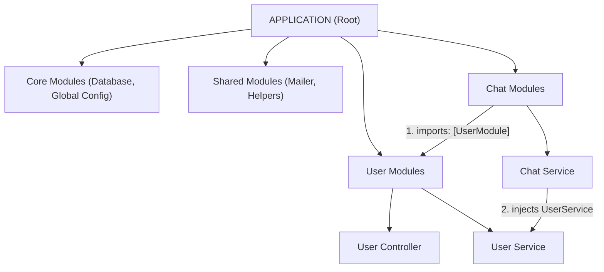

# 🧠 NestJS DI Explained: Providers & Tokens — Hərtərəfli Tədris Təlimatı (#24)

Salam! NestJS öyrənmə yolunda irəliləyən əziz tələbəm, xoş gəldin! 

Bu sənəddə **`24_DI_explained_providers_tokens`** mövzusunu — NestJS-in ürəyi sayılan **Provider (Provayder)** anlayışını, **DI Token (Açar)** sistemini, provayderlərin 4 müxtəlif tipini (`useClass`, `useValue`, `useFactory`, `useExisting`) və böyük layihələrdə modullararası asılılıq ağacını (Application Architecture) **heç bir şəkil olmadan**, sırf aydın sxemlər və canlı TypeScript kodları ilə sıfırdan öyrənəcəksən.

---

## ❓ 1. Provider (Provayder) Nədir?

### 💡 Sadə İzah:
NestJS-də `@Injectable()` bəzədicisi ilə işarələnmiş hər bir klas bir **Provider**-dir. 

* **Məqsədi:** Biznes məntiqini icra etmək, verilənlər bazası ilə işləmək, fayl oxumaq, mail göndərmək və ya hesablama aparmaqdır.
* **Növləri:** Servislər (`UserService`), Repositoriyalar (`UserRepository`), Köməkçi klaslar (`HelperService`), Factory-lər və s. hamısı birer Provider-dir.

---

## 🔑 2. DI Token (Dependency Injection Açarı) Nədir?

NestJS DI Container bir servisi necə tanıyır? **Token (Açar)** vasitəsilə!

Biz modulda `providers: [UserService]` yazdıqda NestJS daxildə bir cütlük (Key-Value) yaradır:
* **Token (Açar):** `UserService` (Klassın özü)
* **Value (Obyekt):** `new UserService()` (Klassın instansiyası)

NestJS-də 3 müxtəlif DI Token istifadə oluna bilər:

```text
1. Class Token  ──► { provide: UserService, useClass: UserService } (Ən çox istifadə olunan)
2. String Token ──► { provide: 'API_SECRET_KEY', useValue: '12345' } (Konfiqurasiya üçün)
3. Symbol Token ──► { provide: Symbol('IPayment'), useClass: Stripe } (Interface Injection)
```

---

## 🛠️ 3. Provider-lərin 4 Müxtəlif Tipi

NestJS-də servisləri modul daxilində 4 müxtəlif yolla qeydiyyatdan keçirə bilərik:

---

### 1️⃣ Class Provider (`useClass` — Dinamik Əvəzetmə)
Mühitdən (Production və ya Development) asılı olaraq başqa-başqa klasları dinamik olaraq inject etmək üçün istifadə olunur:

```typescript
@Module({
  providers: [
    {
      provide: 'LOGGER_SERVICE', // Token
      useClass: process.env.NODE_ENV === 'production'
        ? ProdLoggerService
        : DevLoggerService, // Mühitə görə daxili klas dəyişir!
    },
  ],
})
export class AppModule {}
```

---

### 2️⃣ Value Provider (`useValue` — Statik Dəyərlər)
Klas deyil, hazır bir **statik obyekt, konfiqurasiya və ya sabit dəyər** inject etmək istədikdə:

```typescript
@Module({
  providers: [
    {
      provide: 'DATABASE_CONFIG',
      useValue: {
        host: 'localhost',
        port: 5432,
        database: 'my_nest_db',
      },
    },
  ],
})
export class AppModule {}

// İstifadəsi:
@Injectable()
export class DatabaseService {
  constructor(@Inject('DATABASE_CONFIG') private readonly config: any) {
    console.log(this.config.host); // 'localhost'
  }
}
```

---

### 3️⃣ Factory Provider (`useFactory` — Dinamik Hazırlanan Obyektlər)
Əgər bir obyektin yaradılması **hesablama, async əməliyyat və ya başqa provayderlərdən asılıdırsa**, `useFactory` istifadə olunur:

```typescript
@Module({
  providers: [
    {
      provide: 'CONNECTION_STRING',
      useFactory: (config: any) => {
        // Dinamik olaraq URL qururuq:
        return `postgres://${config.host}:${config.port}/my_db`;
      },
      inject: ['DATABASE_CONFIG'], // 👈 Başqa provider-i factory-yə inject edirik!
    },
  ],
})
export class AppModule {}
```

---

### 4️⃣ Existing Provider (`useExisting` — Ləqəb / Alias Yaratmaq)
Mövcud olan bir provayderə ikinci bir Token (ləqəb) vermək üçün:

```typescript
@Module({
  providers: [
    AliasedLoggerService,
    {
      provide: 'OLD_LOGGER',
      useExisting: AliasedLoggerService, // 'OLD_LOGGER' çağırılanda AliasedLoggerService verilir
    },
  ],
})
export class AppModule {}
```

---

## 🏗️ 4. Şəkildə Gördüyümüz Layihə Arxitekturası (Application Tree)

Şəkildəki layihə hiyerarxiyasını nəzərdən keçirək:



### 🔍 Strukturdakı Modulların Rolu:
1. **Core Modules:** Bütöv tətbiq üçün tək olan qlobal servisləri (Database qoşulması, Logger) saxlayır.
2. **Shared Modules:** Layihənin hər yerində təkrar istifadə olunan köməkçi modulları (DateFormatter, MailService) saxlayır.
3. **User & Chat Modules:** Öz biznes sahələrinə cavabdeh olan daxili modullardır. `ChatModule` istifadəçinin kimliyini yoxlamaq üçün `UserModule`-u import edir, `ChatService` isə `UserService`-i daxilinə inject edir!

---

## 💻 5. Bütöv Canlı Kod Nümunəsi

Sən üçün yaradılmış [di-providers.example.ts](file:///c:/Users/User/Desktop/backend-roadmap-enginering/1_Nest_js/24_DI_explained_providers_tokens/di-providers.example.ts) faylına nəzər salaq:

```typescript
// 📄 di-providers.example.ts
import { Module, Injectable, Inject } from '@nestjs/common';

// 1. İnterfeys və Symbol Token
export interface PaymentGateway {
  pay(amount: number): string;
}
export const PAYMENT_GATEWAY_TOKEN = Symbol('PAYMENT_GATEWAY_TOKEN');

@Injectable()
export class StripeService implements PaymentGateway {
  pay(amount: number): string {
    return `${amount} AZN Ödənildi!`;
  }
}

// 2. Modulda Qeydiyyat
@Module({
  providers: [
    { provide: PAYMENT_GATEWAY_TOKEN, useClass: StripeService },
    { provide: 'API_URL', useValue: 'https://api.example.com' },
  ],
})
export class AppModule {}

// 3. Servisdə İstifadəsi
@Injectable()
export class OrderService {
  constructor(
    @Inject(PAYMENT_GATEWAY_TOKEN) private readonly payment: PaymentGateway,
    @Inject('API_URL') private readonly apiUrl: string,
  ) {}

  makePayment() {
    return this.payment.pay(50);
  }
}
```

---

## 🎯 6. Yekun Xülasə (Qızıl Qaydalar)

1. **Provider:** `@Injectable()` olan və biznes məntiqini saxlayan hər bir klasdır.
2. **DI Token:** DI konteynerində provayderin **"şəxsiyyət vəsiqəsi" / açarıdır** (`Class`, `String`, `Symbol`).
3. **`useClass`:** Klassı dinamik olaraq əvəzləmək üçündür (Prod vs Dev).
4. **`useValue`:** Statik obyekt, konfiqurasiya və ya konstantları inject etmək üçündür.
5. **`useFactory`:** Başqa servislərdən istifadə edərək asinxron və ya hesablama ilə obyekt yaratmaq üçündür.
